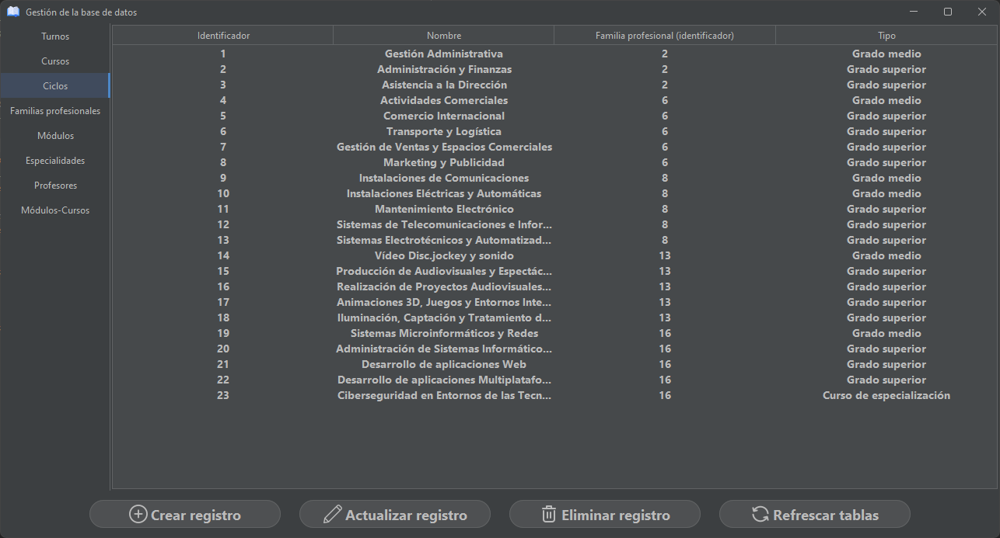
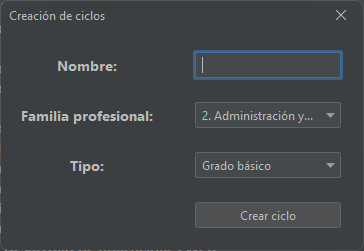
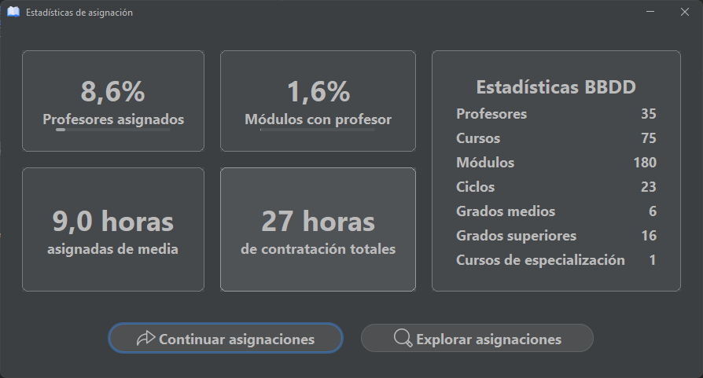
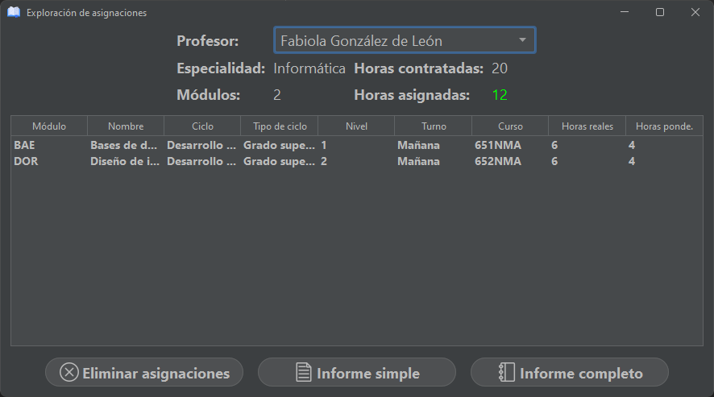
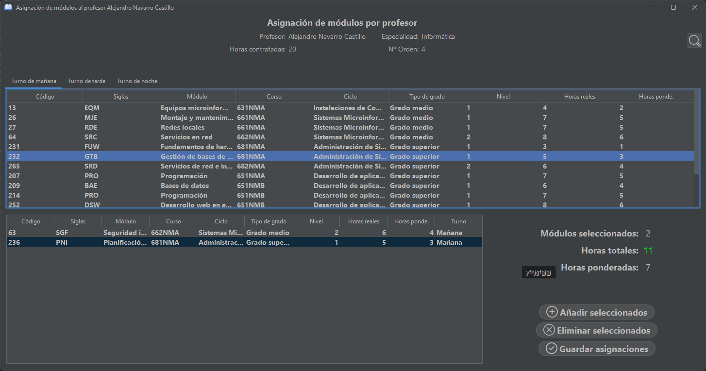

# Assignments

Assignments is an app that allows teachers to create assignments for studies.

The project was built using **Java**, **Java Swing** and **SQL**
as part of a learning exercise.

> [!NOTE]  
This app was developed during my time as a student, under a tight deadline
and while managing other projects. It offers the core functionality,
but you may encounter bugs, rough edges, and code that’s not production-ready.

# Screenshots

  
  
  
  
  
  

